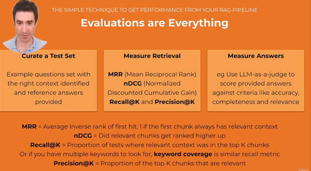
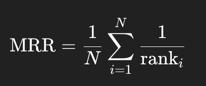

Yes. Let’s break **MRR in RAG** down clearly, without hand-waving.

---

## 1️⃣ What MRR stands for

**MRR = Mean Reciprocal Rank**

It is a **ranking quality metric** used in **information retrieval**.

In RAG (Retrieval-Augmented Generation), it evaluates **how well the retriever ranks the correct document(s)** for a given query.

> MRR answers the question:
> **“How high does the first relevant document appear in the retrieved list?”**

---

## 2️⃣ Why MRR matters specifically in RAG

In RAG systems:

* The **retriever** fetches top-K chunks/documents
* The **generator** relies heavily on the **top few retrieved items**
* If the correct context is **ranked low**, the LLM:

  * Hallucinates
  * Gives incomplete answers
  * Appears “confident but wrong”

MRR directly measures this **retrieval bottleneck**.

---

## 3️⃣ Definition (formal)

For a single query:

If:

* Relevant doc is at rank 1 → RR = 1.0
* Rank 2 → RR = 0.5
* Rank 5 → RR = 0.2
* Not in top-K → RR = 0

**MRR** is the **average RR across all queries**:

---

## 4️⃣ Simple RAG example

Suppose we evaluate **5 questions**:

| Query | Rank of first relevant chunk | Reciprocal Rank |
| ----- | ---------------------------- | --------------- |
| Q1    | 1                            | 1.0             |
| Q2    | 2                            | 0.5             |
| Q3    | 4                            | 0.25            |
| Q4    | Not retrieved                | 0               |
| Q5    | 1                            | 1.0             |

[
MRR = (1 + 0.5 + 0.25 + 0 + 1) / 5 = 0.55
]

---

## 5️⃣ What MRR tells you (and what it doesn’t)

### ✅ What it tells you well

* Whether **relevant context is ranked early**
* How effective your:

  * Embeddings
  * Chunking strategy
  * Vector index
  * Hybrid search (BM25 + vector)
* Whether reranking is working

### ❌ What it does *not* tell you

* Whether **multiple relevant documents** were retrieved
* Whether the **generated answer is correct**
* Whether retrieved chunks are **complete or coherent**

MRR focuses on **first hit only**.

---

## 6️⃣ MRR vs other RAG metrics

| Metric       | Measures                             | Use case                           |
| ------------ | ------------------------------------ | ---------------------------------- |
| **MRR**      | Rank of first relevant doc           | Early relevance (critical for RAG) |
| Recall@K     | Whether relevant docs appear at all  | Coverage                           |
| Precision@K  | How many retrieved docs are relevant | Noise                              |
| nDCG         | Graded relevance                     | Complex relevance ranking          |
| Faithfulness | LLM grounding                        | Generation quality                 |

**In RAG**, MRR is often paired with **Recall@K**.

---

## 7️⃣ Typical MRR ranges in practice

Rough intuition (depends on domain):

* **0.1 – 0.3** → Weak retrieval
* **0.3 – 0.5** → Usable but risky
* **0.5 – 0.7** → Good
* **0.7+** → Strong retriever

For production RAG:

> You usually want **MRR ≥ 0.5** for critical Q&A.

---

## 8️⃣ How MRR connects to real RAG failures

Low MRR usually means:

* Over-chunking (semantic dilution)
* Bad embedding model for the domain
* Query rewriting missing key terms
* Missing reranker
* Top-K too small

High MRR but bad answers usually means:

* Context formatting issues
* Generator prompt problems
* Long context truncation

---

## 9️⃣ Key takeaway (mental model)

Think of MRR as:

> **“How quickly does the retriever get me something useful?”**

In RAG:

* **Rank 1 matters a lot**
* **Rank 5 might as well be invisible**
* MRR directly correlates with hallucination rate

---
