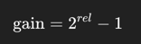
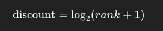
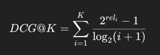
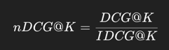
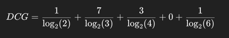
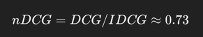

# 1️⃣ What nDCG stands for

**nDCG = Normalized Discounted Cumulative Gain**

It measures **ranking quality when relevance is graded**, not just relevant vs non-relevant.

> nDCG answers:
> **“How well did the retriever rank *all* relevant documents, and how much did it favor higher ranks?”**

---

# 2️⃣ Why nDCG matters in RAG

In RAG, relevance is often **not binary**:

* One chunk may:

  * Fully answer the question
  * Partially answer it
  * Provide weak background context
* Some chunks are **more useful** than others

nDCG captures:

* **Multiple relevant chunks**
* **Different relevance levels**
* **Position bias** (top ranks matter more)

This makes it more expressive than MRR.

---

# 3️⃣ Core idea (intuition first)

nDCG is based on **three ideas**:

1. **Gain** – How relevant is a document?
2. **Discount** – Relevance matters less the lower it appears
3. **Normalization** – Score is scaled between 0 and 1

---

# 4️⃣ Step-by-step breakdown

## 4.1 Gain

Each retrieved document is assigned a **relevance score**, e.g.:

| Relevance | Meaning                    |
| --------- | -------------------------- |
| 3         | Perfect / directly answers |
| 2         | Partially relevant         |
| 1         | Weakly relevant            |
| 0         | Irrelevant                 |

Gain is often computed as:

This emphasizes **high relevance more strongly**.

---

## 4.2 Discount

Documents lower in the ranking count less:

So:

* Rank 1 → full weight
* Rank 5 → much less weight

---

## 4.3 DCG (Discounted Cumulative Gain)

This is your **actual ranking score**.

---

## 4.4 IDCG (Ideal DCG)

Compute DCG again, but with documents **perfectly sorted by relevance**.

This gives the **maximum possible score** for that query.

---

## 4.5 nDCG

Final score:

* **1.0** → perfect ranking
* **0.0** → terrible ranking

---

# 5️⃣ Concrete RAG example

Suppose a query retrieves 5 chunks with relevance:

| Rank | Chunk | Relevance |
| ---- | ----- | --------- |
| 1    | A     | 1         |
| 2    | B     | 3         |
| 3    | C     | 2         |
| 4    | D     | 0         |
| 5    | E     | 1         |

### DCG calculation

Now reorder ideally: **[3, 2, 1, 1, 0]** → compute IDCG.

Then:

---

# 6️⃣ How nDCG differs from MRR

| Aspect                 | MRR                | nDCG         |
| ---------------------- | ------------------ | ------------ |
| First relevant doc     | ✅ Yes              | ⚠️ Indirect  |
| Multiple relevant docs | ❌ No               | ✅ Yes        |
| Graded relevance       | ❌ No               | ✅ Yes        |
| Position sensitivity   | High (rank 1 bias) | Smooth decay |
| Complexity             | Simple             | More complex |

**MRR**: “Did I get something useful early?”
**nDCG**: “How good was my overall ranking?”

---

# 7️⃣ When to use nDCG in RAG

Use nDCG when:

* You retrieve **multiple chunks** per query
* You have **human-annotated relevance scores**
* Partial relevance matters
* You use **rerankers**
* You care about **ordering quality**, not just recall

---

# 8️⃣ Typical nDCG values in practice

Very rough intuition:

* **< 0.4** → Poor ranking
* **0.4 – 0.6** → Acceptable
* **0.6 – 0.8** → Good
* **0.8+** → Excellent

nDCG tends to be **lower than people expect**—it’s strict.

---

# 9️⃣ How nDCG reveals issues MRR hides

You can have:

* **High MRR** (good first hit)
* **Low nDCG** (rest of ranking is garbage)

This often means:

* Embeddings retrieve *something right*
* But ranking consistency is poor
* Reranker is missing or misconfigured

---

# 🔑 Final mental model

Think of nDCG as:

> **“If I care about *ordering quality* and *relative usefulness*, how close am I to the perfect ranking?”**

In RAG:

* MRR protects you from hallucinations
* nDCG protects you from **subtle, low-quality context**

---